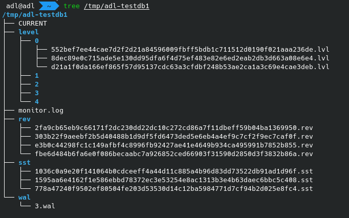

### 版本控制
---

这里的版本控制不是快照读取，而是我们如何记录和保存所有磁盘上的 `sstable` 的元数据。由于每次 `minor compaction` 和 `major compaction` 都会生成新的 `sstable`，造成整个版本视图发生变化，我们需要一种机制去记录这些版本突变。

另一方面如果当我们在某个版本上进行读取的时候，发生版本突变时我们不应当立即回收掉这个版本的 `sstable`，而是应当等待之后合适的时机再回收。

#### 我的思考

在 leveldb 中是通过 `manifest` 这样一个预写日志文件去记录基础版本和每一次的版本突变。每当重启的时候，都需要将基础版本加上每次的版本突变形成一个新的版本。然而我觉得这样的增量存储形式会显得格外复杂，而且重启时可能需要多次叠加版本突变的过程会很耗时。因此我想到 `git` 中实现版本控制的方法，并利用到 `ADLsm-Tree` 的实现中。在版本控制上，`leveldb` 和 `git` 存在共性。

在 `git` 中，整个版本控制抽象成四种对象，分别是：

* `commit` 提交对象，存储提交树索引和父提交索引等信息。
* `tree` 提交树对象，存储当前版本所有文件索引。
* `blob` blob 对象，存储压缩后的普通文件。
* `tag` 标签对象，存放指向的提交的索引，标签信息和其他元数据。

我们每次使用 `git add` 都会将整个仓库中每一个文件计算一次 `SHA1`，作为压缩后的文件的存储地址，这样的文件在 `git` 中被称为 `blob` 对象。接着 git 的 `index` 文件中会记录这个 `blob` 对象的 `SHA1`，文件名，类型，紧接着在 `git commit` 的时候会将这个 `index` 中的数据生成 `tree` 对象并存储到其 `SHA1` 计算的存储地址上，最后将这个 `tree` 对象的 `SHA1`，当前版本 `commit` 的 `SHA1`，用户的提交信息等元数据写入到一个 `commit` 对象中，也会计算 `SHA1` 并存储。最后通过修改 `git` 中的 `HEAD` 伪引用跟踪新版本的 `commit` 对象（也有可能跟踪的是 branch），这样就可以做到切换版本的作用。这种版本控制的数据结构被称为 `Merkle Tree`。除了可以用来快速查找某个版本的所有文件，还可以用来通过 SHA1 校验和来保障版本之间没有受到篡改。同时 `git` 中对于所有对象文件之间的管理都非常 **优雅**，因为每个对象都有一个 `SHA1` 的 **指针**，我们可以很方便的通过 `SHA1` 来获取对象的内容和元数据。

所以在借鉴了 git 的设计思想之后，我们来设计 `ADLsm-tree` 的版本控制。

三种对象：

* `sst` 对象，表示一个 sstable 文件。
* `level` 对象，表示一个 level 层，存储当前层的所有 sstable 元数据和索引。
* `revision` 对象，表示一个版本，存储所有 level 对象的层级和索引。

### sst 对象

`sst` 对象，就是将 `sstable` 文件计算了 `SHA256`，并存储到 `dbname/objects/sst/xxx.sst` 的位置。每次发生 `minor compaction` 和 `major compaction` 都会生成新的 `sst` 对象。

### level 对象

`level` 对象首先记录当前的层级和当前层的 `sst` 的数量，然后会记录当前层所有 `sst` 对象的 `SHA256` 和所有元数据。
第 n 层 `level` 对象文件位于 `dbname/objects/level/<n>/xxx.lvl`。

Level Format:

  | Level | FileNum |
  | ----- | ------- |
  | 1     | 3       |

  | num-keys | max-seq | min-key len | min-key | max-key len | max-key | SHA             |
  | -------- | ------- | ----------- | ------- | ----------- | ------- | --------------- |
  | 3        | 5       | 3+9         | adl     | 6+9         | alskdj  | `<sstable-sha>` |
  | 100      | 10      | 5+9         | basld   | 7+9         | caslkdj | `<sstable-sha>` |
  | 4        | 15      | 6+9         | esakld  | 7+9         | faslkdj | `<sstable-sha>` |
  | 56       | 20      | 6+9         | fjaskl  | 4+9         | qeku    | `<sstable-sha>` |
  | 7        | 25      | 5+9         | ylyly   | 4+9         | zzzz    | `<sstable-sha>` |

(注意上图中的 `min-key` 和 `max-key` 没有画出其 `seq` 和 `op_type`)

### revision 对象
`revision` 对象会记录每一层的层级和每一层 `level` 对象的 `SHA256`。
ADLsm-tree 中默认设置 5 层，所以 `revision` 对象最多记录 5 个 level 对象。
`revision` 对象文件位于 `dbname/objects/rev/xxx.rev`。

Revisions Format:

  | LEVEL | SHA           |
  | ----- | ------------- |
  | 0     | `<level-sha>` |
  | 1     | `<level-sha>` |
  | 2     | `<level-sha>` |
  | 3     | `<level-sha>` |
  | 4     | `<level-sha>` |

#### CURRENT 文件

`CURRENT` 通过 `SHA256` 指向当前版本的 `revision`。之后跟着的是当前版本所有预写日志的数量和每个日志的 `id`，每次版本突变，都会将旧版本所有的预写日志写入到新版本中。等到每次内存表落盘成功后，会将预写日志删除，这同样也会在新版本写入 `CURRENT` 时更新当前版本所有预写日志的数量和每个日志的 `id`。

`CURRENT` 伪引用文件位于 `dbname/CURRENT`。

CURRENT Format:

`revision-sha n logs[0].id logs[1].id ... logs[n-1].id`

#### 版本生成流程

首先最初始化版本啥也没有，咱的 `CURRENT` 刚开始是空的。当 `memtable` 第一次写到磁盘上的 `sstable` (`minor compaction`), `sstable` 元数据比如最小键，最大键，哈希值会被更新到 `level` 文件，然后 `level` 文件的哈希值会被更新到 `revision` 最后 `revision` 的哈希值会被更新到 `CURRENT` 文件里面。`major compaction` 同理，也会生成一些 `sstable`，同理也会更新 `level`，`revision`, `CURRENT`。

内存中保存是 `CURRENT` 指向的版本对象的一个内存对象，每次发生元数据更改的时候，大致的公式是：`new-revision = current-revision + meta-file-changes; current = new-revision`。目前不打算记录版本之间的链式的关系，因为我们没有一个合适的需求去遍历这些旧版本。

### 其他方面的思考（未开发功能）
1. Snapshot 我们可以通过快照来保存版本，比如我们可以通过 `snapshot` 来保存一个 `revision` 的快照，然后通过 `revision` 的快照来恢复到某个版本。
2. GC 需要考虑何时进行垃圾回收：IDLE？Every-N-Seconds？Every-N-Files?

### 效果展示

